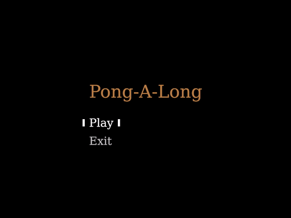

# Pong-A-Long
Atari's 1972 classic pong, made with rust.

# Background
The project is first and foremost about learning `Rust`. But also about getting my hands dirty with game development. Starting slow without much help. The engine used in this project is [ggez](https://ggez.rs/).
Future games I will explore and recreate will be _Snake_ and _Tetris_. 

# Setup
Install [rust](https://www.rust-lang.org/learn/get-started) + cargo

Clone the repo to your desktop

# Usage 
Go to the `root` folder and execute `cargo run` 

# Future features and development
- Options menu to set max score, paddle size, speed
- Items in the game which will dynamically change the game state
- About page, describing a bit about the project
- Be able to read from file
- Transition animation between scenes
- Explore [WASM](https://www.rust-lang.org/what/wasm)
- Upload to [itch.io](https://itch.io/) (using wasm)

# Known bugs 
- Collisions for the paddles are a bit off sometimes
